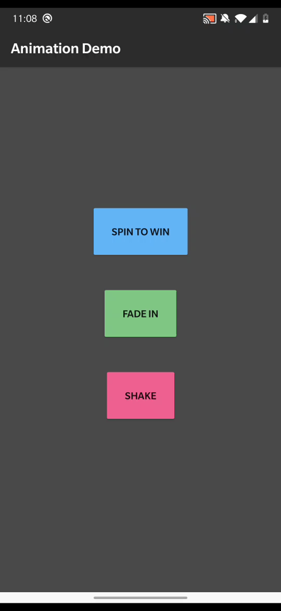
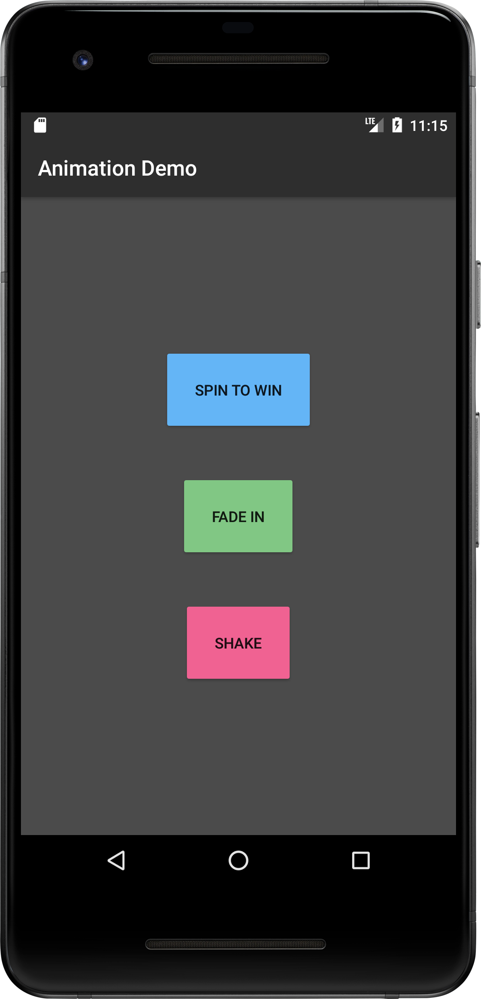

# Animation Demo Project

Source code for a tutorial on creating animations in android

 

### Quick Links to files
- [MainActivity.kt](/app/src/main/java/com/armpatch/android/animationdemoproject/MainActivity.kt) 
- [Animators.kt](/app/src/main/java/com/armpatch/android/animationdemoproject/Animators.kt) 
